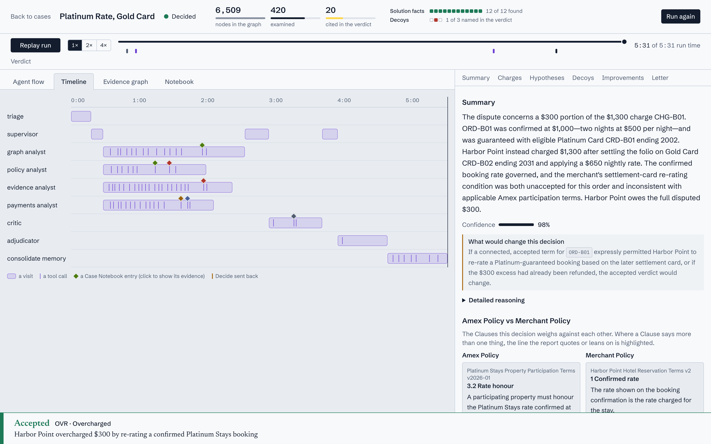
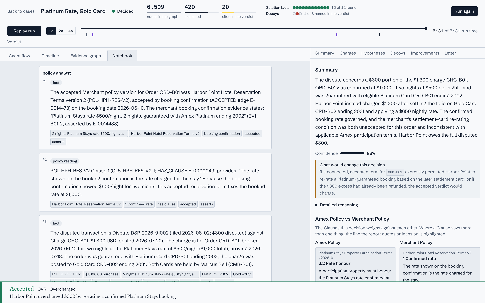
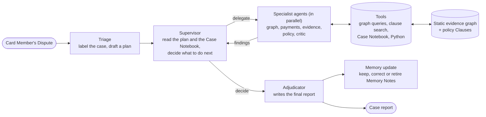

# DisputeAI: an agent team that decides American Express disputes from a graph

DisputeAI is a proof of concept for an AI system that investigates card disputes for American
Express's own disputes team. Amex issues the Card, runs the network and signs the Merchant, so one
team hears the Card Member and holds the Merchant's agreement. A Card Member says "this charge is
wrong". The system works out what actually happened, decides the outcome for every disputed
charge, and writes an evidence-backed report. No human takes part in the loop.

## Objective

Most disputes look simple and are not. A refused return turns out to be a made-to-order sofa the
Card Member agreed was final sale. A "missing discount" is an Amex Offer added to a different Card.
A "second payment" is partly a payment to the venue's sister catering business. The answer is
rarely in one record. It appears when you **connect the right records and the right Clauses**:
which Card was used, which policy version the Card Member accepted, which Amex terms bind the
Merchant.

The project shows that idea end to end:

- **The evidence is a graph.** Card Members, accounts, Cards, Merchants, charges, orders, Offers,
  subscriptions, invoices, past Disputes and Merchant Submissions are nodes. Amex Policies and
  Merchant Policies are there too, split into Clauses and linked to what they govern. The graph is
  static and read-only: agents never write to it.
- **The decisions belong to the language model.** Nothing is hard-coded per case. The agents choose
  what to investigate, what the evidence means and what the outcome is.
- **Everything is visible.** Each plan, delegation, query, Case Notebook entry and decision is
  recorded as it happens, shown live in the interface, and can be replayed afterwards.

## What you see

Pick one of five dispute cases. A case with a recorded run replays it; "Run again" starts a live
investigation. The run page has four views of the same run, and the header counts the search:
nodes in the graph, nodes examined, nodes cited in the verdict.

**Agent flow** shows who is working: triage and the supervisor on the left, the specialists in the
middle and the adjudicator on the right, with how often each ran and how many tools it called.
Clicking an agent opens exactly what it was asked, what it answered and which tools it used.


**Timeline** draws one lane per agent over time, with a tick per tool call, a diamond per Case
Notebook entry and a marker wherever the supervisor sent a decision back.



**Evidence graph** shows the records the agents touched, grouped into four regions (Parties,
Commerce, Terms, Case) whose colours come from the ontology. After the verdict it narrows to the
records the report cites. Clicking a node shows its properties and connections.


**Notebook** is the Case Notebook: every finding the agents logged, by author and kind (fact,
policy reading, conflict, ruled out, improvement idea), each citing graph and Clause ids that light
up in the graph.



**The report** sits beside the graph once the case is decided: the verdict and Dispute Category, a
decision per charge (disputed amount, credit, Card Member liability), the reasoning, the look-alikes
ruled out, the Clauses relied on, **System Improvements** (changes to an Amex Policy, a Merchant
Policy, a process or data that would have prevented the Dispute) and a letter to the Card Member.
Every claim links to its evidence. Where an Amex Clause and a Merchant Clause conflict, they are
shown side by side with the deciding sentence marked.

## Architecture



The pieces, in plain words:

- **Triage** reads the Dispute and its immediate surroundings, names the kind of case, lists the
  hypotheses worth testing and writes an investigation plan.
- **Supervisor** is a loop. Each turn it reviews the plan and the Case Notebook, then either hands
  out tasks to the role catalog in `config/agents.yaml` or decides the investigation is done.
- **Specialists** run in parallel as Deep Agents. Each one queries the graph, searches policy
  Clauses, precedents and Memory Notes, does arithmetic, logs cited findings to the **Case
  Notebook** and reports back. A critic challenges the leading explanation before a decision.
- **Adjudicator** re-checks the record and produces the structured, evidence-cited case report.
- **Memory update** turns lessons from the case into Memory Notes in the knowledge store, and
  supersedes or retracts notes that newer facts contradict.
- **Skills** in `skills/` are short knowledge documents the agents load when relevant: how to
  explore the graph, how to read a policy version, how Offers and benefits work, how verdicts
  differ. They never name a graph label or edge type.
- **Limits** are the only hard rules: a maximum number of turns and a stop when no progress is made.
  Reaching either sends the case to the adjudicator with a note.

**Policies live in two places.** Each Amex Policy and Merchant Policy is one markdown file in
`data/corpus/policies/`. The generator projects it into the graph (a document node, a node per
Clause, and edges to the Merchant, order, subscription or Offer it governs, including the exact
version the Card Member accepted) and into the search index (one document per Clause, with the
Clause id as its id), so a search hit is also a graph node the agent can follow.

**The schema is data.** Every label, edge type and property of the graph, with a description, is in
`data/generator/ontology.yaml`. Agents read it through the `graph_schema` tool; the interface takes
its regions and colours from it. To change the graph, edit `ontology.yaml` and the generator; a
test keeps label and edge names out of the prompts, skills and runtime code.

Built on LangChain Deep Agents and LangGraph for the agents, LadybugDB for the graph, SQLite (FTS5
and sqlite-vec) for search and the Case Notebook, FastAPI for the server and React for the
interface.

## Merchant agent (built, not wired)

The optional Merchant agent answers a typed evidence request from files under one Merchant's
records folder. Its tools list and read those records, and it returns a structured Merchant
Submission that can be saved as JSON. `data/merchant_records/MER-HGF/` contains sample order and
checkout terms files. Every showcase Merchant Submission is already in the generated graph; live
investigations do not call this agent.

To try the extension from the repository root, with an OpenAI API key configured:

```python
from pathlib import Path

from extensions.merchant_agent.agent import respond
from extensions.merchant_agent.contract import EvidenceAsk, MerchantEvidenceRequest
from extensions.merchant_agent.store import save_submission
from models import chat_model

request = MerchantEvidenceRequest(
    dispute_id="DSP-2026-91001",
    merchant_id="MER-HGF",
    charge_ids=["CHG-A01"],
    asks=[EvidenceAsk(topic="accepted terms", detail="Show the checkout acceptance for ORD-A01")],
)
submission = respond(request, Path("data/merchant_records"), chat_model())
submission = submission.model_copy(update={"submission_id": "MSB-HGF-DEMO"})
save_submission(submission)
```

Run `uv run python data/generator/gen.py` to rebuild the static graph with saved submissions.
For future wiring, a `request_merchant_evidence` tool could call `respond` and trigger a rebuild,
or the submission could be placed in the Case Notebook. The extension is intentionally not
connected to the investigation runtime or agent configuration.

## How to run

You need Python 3.11 or newer with [uv](https://docs.astral.sh/uv/), Node.js, and an OpenAI API key
for live runs only.

1. Install the backend and the frontend.

   ```
   uv sync --extra dev --extra api
   cd frontend && npm ci && cd ..
   ```

2. Start everything.

   ```
   ./dev.sh
   ```

   On its first start the API restores the committed showcase (see below) into `data/generated/`
   and `trajectory.sqlite`, which takes a few seconds. Nothing has to be built or unzipped by hand.
   Open http://127.0.0.1:5173. Each of the five cases already has a completed run: click a case
   to open its trajectory, agent flow, evidence graph, Case Notebook and conclusion. No key and no
   model call is needed. "Run again" starts a fresh live run, which needs the key (step 3) and
   takes about five minutes.

3. Only for live runs, put your key in a file named `.env` at the repository root.

   ```
   OPENAI_API_KEY=your-key
   ```

### The committed showcase

`data/showcase/` (about 2 MB) makes a fresh clone usable without a model or a rebuild. For each
of the five cases it holds one completed run that passed evaluation, plus the data the interface
reads:

| File | Content |
|---|---|
| `graph/nodes.jsonl.gz`, `graph/edges.jsonl.gz`, `graph/ontology.json` | The static evidence graph (gzipped JSONL) and its described schema |
| `runs/<run_id>.events.jsonl.gz` | A run's full trajectory: plan, delegations, every tool call with inputs and outputs, Case Notebook entries and the decision |
| `knowledge.sqlite` | The policy-clause and precedent search index |
| `case_catalog.json` | The case list shown in the interface (no answers) |
| `ground_truth/`, `eval.json` | Evaluator-only answers and the latest score per case, for the evaluation overlay |

The API restores whatever is missing when it starts. To restore without starting it:

```
uv run inspect showcase-install
```

This rebuilds `data/generated/evidence.lbug` from the JSONL, copies the catalog, knowledge index,
ground truth and scores into `data/generated/`, and loads the run events into `trajectory.sqlite`.
It only fills in what is missing, so it is safe to run again. To start over, delete
`data/generated/` and `trajectory.sqlite`. The `.gz` files are plain gzip, so
`zcat data/showcase/runs/<run_id>.events.jsonl.gz | head` shows a run's events.

After new runs you want to keep, refresh the snapshot and commit it. The export takes, per case,
the newest run that passed evaluation (else the newest completed run):

```
uv run inspect showcase-export
git add data/showcase && git commit -m "Update showcase"
```

To rebuild the dataset from scratch instead (a few seconds, identical every time), run
`uv run python data/generator/gen.py`. That does not include stored runs. To score the agents
against the ground truth with the real model, run `uv run inspect eval --k 1` (each case takes
about five minutes; `--k 3` scores pass@3 and `--cases B` picks cases). The last evaluation
passed all five cases at pass@1 and pass@3. A sleeping laptop freezes runs mid-call, so keep it
awake for long evaluations, for example with `caffeinate -s uv run inspect eval --k 3` on macOS.

The model is set in `config/models.yaml`, the roles and prompts in `config/agents.yaml`, and the
skills in `skills/`.

## The data

Everything is synthetic and generated from a fixed seed, so every build is identical
(`uv run python data/generator/gen.py`).

**A dispute-only background world.** About 150 Card Members (some with two Card Products, some as
Additional Card Members on someone else's account), 30 Merchants with their own Merchant Policies,
about 3,000 charges, 1,200 orders, returns, subscriptions, invoices paid partly by bank transfer,
Amex Offers enrolled on specific Cards, the Platinum Stays hotel program and about 60 resolved past
Disputes with Merchant Submissions. It is full of innocent look-alikes: namesakes, affiliated
Merchants, standard and custom versions of one product, several plans at one streaming Merchant.

**Five showcase cases hidden in that noise.** Each one is solvable only by connecting graph records
and Clauses, each has a decoy that looks like the answer, and the surface story points the wrong
way.

| Case | Category | What it shows |
|---|---|---|
| Final Sale Means Final | RET Returned / Refused | A refused sofa return, and which of a Merchant's two policy pages the Card Member actually accepted |
| Platinum Rate, Gold Card | OVR Overcharged | A hotel's folio terms against the Amex program terms the hotel agreed to |
| The Offer on the Other Card | OVR Overcharged | A missing $100 credit, the Card the Offer was added to, and when Amex may pay goodwill |
| Paid by Transfer | PDD Paid by Other Means | Two bank transfers and a card charge against a venue invoice and its sister caterer |
| Cancelled the Wrong Plan | CNR Recurring Billing | A cancelled subscription, the plan still billing, and the Card it bills to |

Together the cases cover five of the six verdicts (accepted, partially accepted, rejected, goodwill
credit, not a dispute; fraud referral is reachable but not exercised) and range from no System
Improvement to an Amex-vs-Merchant Clause conflict.

**Policies the agents can search.** Six Amex Policies (Merchant Regulations, Card Member Agreement,
Offer terms, Platinum benefit terms, Platinum Stays participation terms and a Dispute Guide), eight
Merchant Policies, generated template policies for the background Merchants, and eight precedents
from resolved Disputes, none of which gives away an answer. The Amex texts are paraphrased and
partly fictional; each file names the public Amex source it is based on. They are not Amex's own
wording.

**Answers are kept apart.** The expected outcome, the key records and the decoys for every case live
in a separate evaluator-only folder. They are never loaded into the graph, the knowledge store, the
prompts or the tools, and are used only to score runs.
