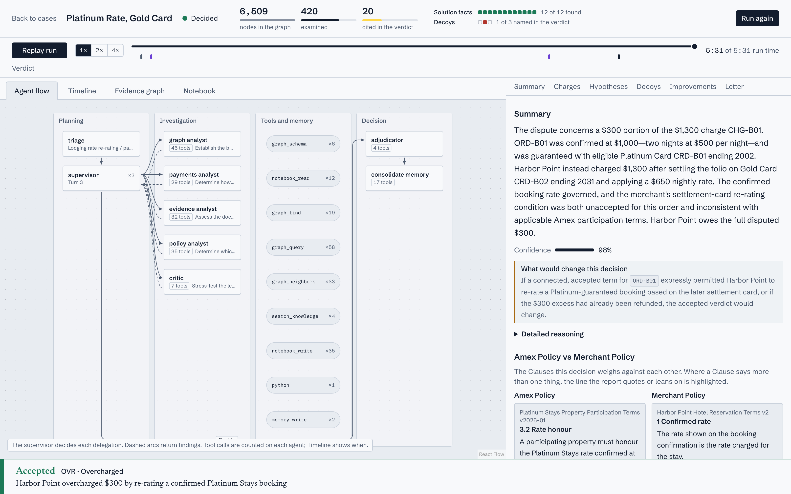
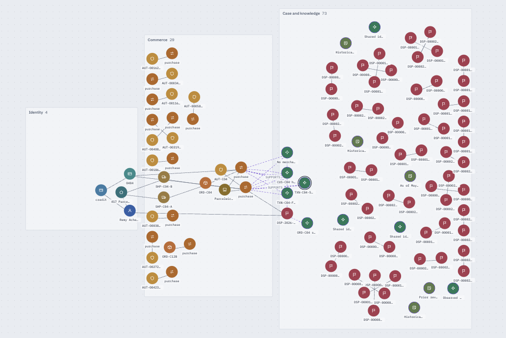
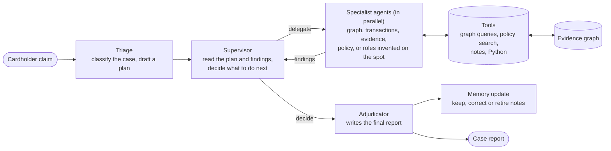

# DisputeAI: an agent that solves card disputes by walking a graph

DisputeAI is a proof of concept for an AI system that investigates card disputes the way a good
fraud analyst would, only faster and with every step on record. A cardholder says "this charge is
wrong". The system works out what actually happened, decides whether the claim should be accepted,
partly accepted or rejected, and writes a full, evidence-backed explanation. No human takes part in
the loop.

## Objective

Most dispute cases look simple on the surface and are not. A "duplicate charge" is really two
shipments of one order. A "fraudulent" coffee purchase is a merchant whose descriptor the cardholder
does not recognise. A "family member fraud" claim is a tablet the household has always used. The
answer is rarely in one record. It appears when you **connect the right records**: a shared address,
a device, a terminal, a mandate, an order.

The project shows that idea end to end:

- **The evidence is a graph.** Customers, accounts, cards, devices, addresses, merchants,
  transactions, orders, shipments, disputes and more are nodes, and the links between them carry
  dates. Cases are built so that the obvious reading is wrong and the graph reveals the truth.
- **The decisions belong to the language model.** Nothing is hard-coded per case. The agents choose
  what to investigate, what the evidence means and what the outcome is.
- **Everything is visible.** Each plan, delegation, query, finding and decision is recorded as it
  happens and shown live in the interface, then can be replayed afterwards.

## What you see

Pick one of ten dispute cases and the system starts investigating. The run page has two views of the
same run, plus a written conclusion at the bottom.

**Agent flow** shows who is working. Planning on the left, the specialists in the middle, the tools
they call, and the final decision on the right. Numbers show how often each agent or tool was used,
dashed arcs show findings returning to the supervisor, and clicking any box opens exactly what that
agent was asked, what it answered and which tools it used.



**Evidence graph** shows what the agents discovered, growing as they work. Identity records, commerce
records and case records sit in their own regions. Nodes the agents wrote themselves (findings,
notes) are drawn dashed. Clicking a node shows its properties, its dated connections and which agent
found it.



**Conclusion** is the product of every run: the verdict, a summary, the reasoning, a decision per
transaction, the hypotheses that were accepted and rejected, the look-alikes that were ruled out,
what evidence was missing, the policies relied on and a letter to the cardholder. Every claim links
to the graph, so clicking a piece of evidence highlights exactly those records.

## Architecture



The pieces, in plain words:

- **Triage** reads the claim and its immediate surroundings, names the kind of case, lists the
  hypotheses worth testing and writes an investigation plan.
- **Supervisor** is a loop. Each turn it reviews the plan and a summary of what is known, then either
  hands out tasks or decides the investigation is done. It may pick a standard specialist or invent
  a new role with its own instructions. It cannot close the case while plan items are still open.
- **Specialists** run in parallel. Each one queries the graph, searches policies and past cases,
  does calculations, records findings in the graph and reports back.
- **Adjudicator** is a dedicated final agent. It reads the whole investigation and produces the
  structured, evidence-cited case report.
- **Memory update** turns lessons from the case into notes that later cases can use, and corrects or
  retires notes that newer facts contradict.
- **Skills** are short knowledge documents the agents load when relevant, such as how to explore a
  graph, how household authority works, or what to do when a merchant never answers.
- **Limits** are the only hard rules: a maximum number of turns and a stop when no progress is made.
  Reaching either sends the case to the adjudicator with a note.

When the merchant never replied, that is not simulated. It is a fact in the graph that the agents
must find, and a skill teaches the cardholder-favourable default.

Built on LangChain Deep Agents and LangGraph for the agents, LadybugDB for the graph, FastAPI for the
server and React for the interface.

## Merchant agent (built, not wired)

The optional Merchant agent answers a typed evidence request from files under one Merchant's
records folder. Its tools list and read those records, and it returns a structured Merchant
Submission that can be saved as JSON. `data/merchant_records/MER-HGF/` contains sample order and
checkout terms files. Every showcase Merchant Submission is already in the generated graph; live
investigations do not call this agent.

To try the extension from the repository root, with an OpenAI API key configured:

```python
from pathlib import Path

from extensions.merchant_agent.agent import respond
from extensions.merchant_agent.contract import EvidenceAsk, MerchantEvidenceRequest
from extensions.merchant_agent.store import save_submission
from models import chat_model

request = MerchantEvidenceRequest(
    dispute_id="DSP-2026-91001",
    merchant_id="MER-HGF",
    charge_ids=["CHG-A01"],
    asks=[EvidenceAsk(topic="accepted terms", detail="Show the checkout acceptance for ORD-A01")],
)
submission = respond(request, Path("data/merchant_records"), chat_model())
submission = submission.model_copy(update={"submission_id": "MSB-HGF-DEMO"})
save_submission(submission)
```

Run `uv run python data/generator/gen.py` to rebuild the static graph with saved submissions.
For future wiring, a `request_merchant_evidence` tool could call `respond` and trigger a rebuild,
or the submission could be placed in the Case Notebook. The extension is intentionally not
connected to the investigation runtime or agent configuration.

## How to run

You need Python 3.11 or newer with [uv](https://docs.astral.sh/uv/), Node.js, and an OpenAI API key
for live runs only.

1. Install the backend and the frontend.

   ```
   uv sync --extra dev --extra api
   cd frontend && npm ci && cd ..
   ```

2. Start everything.

   ```
   ./dev.sh
   ```

   On its first start the API restores the committed showcase (see below) into `data/generated/`
   and `trajectory.sqlite`, which takes a few seconds. Nothing has to be built or unzipped by hand.
   Open http://127.0.0.1:5173. Each of the five cases already has a completed run: click a case
   to open its trajectory, agent flow, evidence graph, Case Notebook and conclusion. No key and no
   model call is needed. "Run again" starts a fresh live run, which needs the key (step 3) and
   takes about five minutes.

3. Only for live runs, put your key in a file named `.env` at the repository root.

   ```
   OPENAI_API_KEY=your-key
   ```

### The committed showcase

`data/showcase/` (about 2 MB) makes a fresh clone usable without a model or a rebuild. For each
of the five cases it holds one completed run that passed evaluation, plus the data the interface
reads:

| File | Content |
|---|---|
| `graph/nodes.jsonl.gz`, `graph/edges.jsonl.gz`, `graph/ontology.json` | The static evidence graph (gzipped JSONL) and its described schema |
| `runs/<run_id>.events.jsonl.gz` | A run's full trajectory: plan, delegations, every tool call with inputs and outputs, Case Notebook entries and the decision |
| `knowledge.sqlite` | The policy-clause and precedent search index |
| `case_catalog.json` | The case list shown in the interface (no answers) |
| `ground_truth/`, `eval.json` | Evaluator-only answers and the latest score per case, for the evaluation overlay |

The API restores whatever is missing when it starts. To restore without starting it:

```
uv run inspect showcase-install
```

This rebuilds `data/generated/evidence.lbug` from the JSONL, copies the catalog, knowledge index,
ground truth and scores into `data/generated/`, and loads the run events into `trajectory.sqlite`.
It only fills in what is missing, so it is safe to run again. To start over, delete
`data/generated/` and `trajectory.sqlite`. The `.gz` files are plain gzip, so
`zcat data/showcase/runs/<run_id>.events.jsonl.gz | head` shows a run's events.

After new runs you want to keep, refresh the snapshot and commit it. The export takes, per case,
the newest run that passed evaluation (else the newest completed run):

```
uv run inspect showcase-export
git add data/showcase && git commit -m "Update showcase"
```

To rebuild the dataset from scratch instead (a few seconds, identical every time), run
`uv run python data/generator/gen.py`. That does not include stored runs. To score the agents
against the ground truth with the real model, run `uv run inspect eval --k 1` (each case takes
about five minutes).

The model is set in `config/models.yaml`, the roles and prompts in `config/agents.yaml`, and the
skills in `skills/`.

## The data

Everything is synthetic and generated from a fixed seed, so every build is identical.

**A realistic background world.** About 2,500 customers with accounts, cards, tokens, devices, IP
addresses, phone numbers, emails and addresses. About 250 merchants with terminals and descriptors,
some of them sub-merchants of marketplaces. About 50,000 transactions over six months, with
authorisations, orders and shipments for online purchases. Around 300 ordinary disputes with their
evidence. The world is full of innocent look-alikes: households sharing an address or a tablet,
roommates on one street, office and mobile-carrier IP addresses, phone numbers recycled between
owners. Relationships carry validity dates, so "who owned this number then" is answerable.

**Ten showcase cases hidden in that noise.** Each one is solvable only by connecting graph records,
each has decoys that look like the answer but are not, and the surface story points the wrong way.

| Case | The claim | What the graph shows |
|---|---|---|
| Coffee by Another Name | Fraud on an unknown charge | The descriptor belongs to a merchant the cardholder already uses |
| Split, Not Double | A duplicate charge | Two shipments of one two-item order |
| Pump Six | Isolated card fraud | Six cards share one compromised fuel pump |
| Family Tablet | Fraud on a family device | A household member with authority used a shared tablet |
| Takeover in a Friendly Mask | Suspected friendly fraud | A takeover ring of about forty accounts sharing one drop address |
| The Porch Ring | Parcels not received | Claimants tied together by shared contact details |
| The Wrong House | Parcels not received | Looks like the ring, but the phone was recycled and the delivery address differs |
| The Agent Booked It | Unauthorised charge | An AI shopping agent exceeded the limits of its mandate |
| The Refund That Crossed | Refund not received | A refund exists but is linked only through the order |
| Yesterday's Reputation | Parcel not received | An old memory note about the merchant is contradicted by newer facts |

Two of the cases (The Wrong House and The Refund That Crossed) also have a merchant that never
answered an evidence request, to test the cardholder-favourable default.

**Knowledge the agents can search.** About 35 policy documents (card network rules, consumer-credit
and electronic-transfer regulations, internal procedures) and 30 short precedents from resolved
cases, none of which give away an answer.

**Answers are kept apart.** The expected outcome, the key records and the decoys for every case live
in a separate evaluator-only folder. They are never loaded into the graph, the prompts or the tools,
and are used only to score runs.
