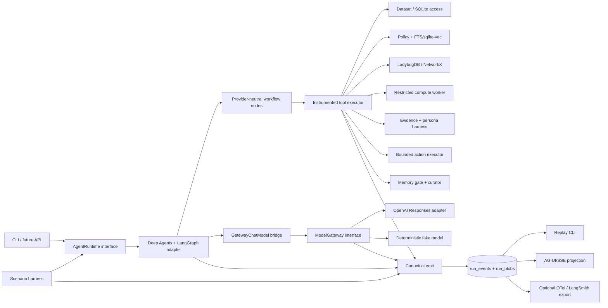
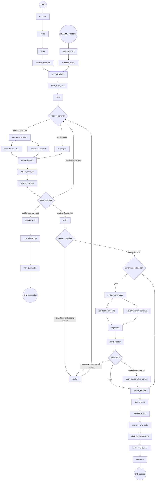
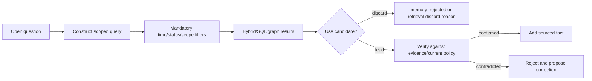
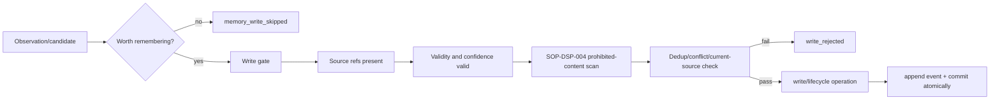

# Dispute Observatory agent architecture

**Status:** Phase 2 implementation blueprint  
**Date:** 13 September 2026  
**Research basis:** [04-agent-architecture-research.md](04-agent-architecture-research.md)  
**Initial runtime:** Deep Agents + LangGraph  
**Default model:** OpenAI `gpt-5.6-luna` through the Responses API

## 1. Architecture decision

Dispute Observatory is a deterministic, event-sourced dispute workflow containing a bounded agentic investigation loop. LangGraph implements the first workflow runtime; Deep Agents implements the lead investigator and configured specialists. Neither owns dispute policy, governance, memory semantics, tools, decision schemas, or audit events.

The design has five rules:

1. **Code owns regulated control.** Routing precedence, deadlines, policy validity, arithmetic, panel predicates, the 0.75 threshold, conservative default, allowed actions, write gates, and termination are deterministic functions.
2. **Agents own bounded inquiry.** The lead chooses which admissible evidence to pursue, which hypotheses to test, and whether another call has decision-changing value.
3. **Sources cross boundaries, not framework objects.** Findings are typed domain records carrying source IDs. OpenAI, LangChain, LangGraph, and Deep Agents objects stay inside adapters.
4. **Every effect passes one instrumented boundary.** A graph node, model, tool, store, sandbox, clock, evidence source, or action cannot run without producing canonical events.
5. **No human path exists.** The only suspension reason is a future external event. Hard cases go to the automated adversarial panel and always terminate in an executed decision by the latest safe time.

### 1.1 System view



### 1.2 Dependency rule

```text
domain <- application/workflow <- ports <- adapters/runtime/providers/storage
```

- `domain` imports only the standard library and Pydantic.
- workflow nodes consume domain models and small protocols from `ports.py`.
- only `adapters/openai_*` imports the OpenAI SDK.
- only `runtime/deepagents_*` and `runtime/langgraph_*` import LangChain, Deep Agents, or LangGraph.
- tools expose domain Pydantic arguments/results; their LangChain tool wrappers live in the runtime adapter.
- evaluator and harness have privileged dataset views that are never handed to an agent tool.

An architecture test scans imports and fails on a concrete provider/framework import outside those modules.

## 2. Package and configuration layout

The first implementation should use the following small-module layout:

```text
pyproject.toml
config/
  models.yaml
  routes.yaml
  agents/*.yaml
  scenarios/*.yaml
skills/
  eligibility-check/SKILL.md
  fraud-cnp/SKILL.md
  lodging-te/SKILL.md
  memory-hygiene/SKILL.md
  not-received/SKILL.md
  recurring-trial/SKILL.md
  reg-e-clocks/SKILL.md
  automated-adjudication/SKILL.md
src/
  domain/
    case.py                 # CaseState, facts, hypotheses, plan, deadlines
    decision.py             # decision-record contract and provenance
    events.py               # discriminated canonical event union
    routing.py              # provider-neutral route predicates/results
    governance.py           # panel predicates, threshold, allowed actions
    memory.py               # note and lifecycle contracts
    model.py                # neutral model request/response/stream contracts
  ports.py                  # ModelGateway, AgentRuntime, stores, clock
  workflow/
    nodes.py                # pure/async node functions
    conditions.py           # deterministic edge predicates
    spec.py                 # node/edge declarations independent of LangGraph
  runtime/
    langgraph_runtime.py    # compile spec, checkpointer, Send/Command mapping
    deepagents_factory.py   # registry -> lead and specialist agents
    gateway_chat_model.py   # neutral gateway <-> LangChain messages
    fake_runtime.py
  adapters/
    openai_responses.py
    fake_model.py
    sqlite_store.py
    vector_store.py
    ladybug_graph.py
    networkx_graph.py
    sandbox.py
  tools/
    registry.py             # decorator + one executor
    case_data.py
    retrieval.py
    evidence.py
    graph.py
    computation.py
    actions.py
    memory.py
  observability/
    emitter.py
    redaction.py
    blobs.py
    replay.py
    agui.py
    otel.py
  harness/
    scenario.py
    clock.py
    scheduler.py
    persona.py
    budgets.py
    recording.py
  evaluation/
    loader.py               # sole ground-truth reader
    deterministic.py
    trajectory.py
    reliability.py
  cli.py
tests/
```

This is not a domain class hierarchy. Most modules contain Pydantic records and plain functions. Protocols exist only at replaceable or privileged boundaries.

## 3. Authoritative run and case state

`CaseState` is provider-neutral and checkpointable:

```python
class CaseState(BaseModel):
    run_id: str
    case_id: str
    scenario_id: str
    status: Literal["running", "suspended", "decided", "failed"]
    resolved_config_hash: str
    route: RouteDecision | None
    case_file: CaseFile
    plan: InvestigationPlan | None
    progress: ProgressLedger
    budgets: BudgetState
    pending_wait: WaitState | None
    specialist_results: list[SpecialistFinding]
    verifier: VerifierResult | None
    panel: PanelRecord | None
    decision: DecisionRecord | None
    checkpoint_id: str | None
    termination_reason: TerminationReason | None
```

The case file is the shared blackboard:

```python
class CaseFile(BaseModel):
    facts: list[Fact]                 # value + source_refs + observed/valid times
    hypotheses: list[Hypothesis]     # proposed/supported/rejected/resolved
    open_questions: list[OpenQuestion]
    deadlines: list[Deadline]
    evidence_matrix: list[EvidenceLink]
    candidate_conditions: list[CandidateCondition]
    contradictions: list[Contradiction]
    requested_evidence: list[EvidenceRequest]
```

Deep Agents sees a virtual projection of this state:

```text
/case/<case_id>/facts.json
/case/<case_id>/hypotheses.json
/case/<case_id>/open_questions.json
/case/<case_id>/deadlines.json
/case/<case_id>/evidence_matrix.json
/case/<case_id>/plan.json
```

Writes to `/case` are parsed, diffed, validated, and converted to state updates and events. The agent never writes the checkpoint database directly. `/policies` and `/skills` are read-only; `/memories` resolves through governed store tools. Paths containing `ground_truth` or `simulation` are denied before filesystem resolution and again in the dataset router.

The Deep Agents runtime implements this with a `CompositeBackend`: `/case` routes to a thread-scoped state backend, `/policies` and `/skills` to guarded read-only filesystem views, and `/memories` to a store-backed projection whose mutations still pass the memory tools. An outer deny wrapper normalizes and rejects forbidden paths before any child backend sees them.

## 4. Graph

### 4.1 Main graph



### 4.2 Node ownership

| Node | Kind | Authority and output |
|---|---|---|
| `run_start` | deterministic | Validate config/capabilities, create run/span, snapshot config |
| `intake` | deterministic + optional structured extraction | Load allowed case inputs; normalize claim; mark untrusted text |
| `route` | deterministic-first router | Regime, dispute/not, family, depth, route, budgets, roles, skills |
| `initialize_case_file` | deterministic | Create source-linked facts and initial hypotheses |
| `compute_clocks` | sandbox helper | Regulatory/network deadlines and latest-safe time |
| `load_route_skills` | runtime | Load selected `SKILL.md` indexes/content and emit each load |
| `plan` / `replan` | lead agent | Typed goals, steps, open questions, stop tests; diff on re-plan |
| `investigate` | lead agent | Choose next admissible tool or focused delegation |
| `fan_out_specialists` | deterministic dispatcher | Bounded `Send` map or dynamic-subagent adapter |
| `merge_findings` | deterministic reducer | Validate schemas, dedupe, preserve branch/source provenance |
| `update_case_file` | deterministic | Apply facts/hypothesis/evidence-matrix diffs |
| `assess_progress` | deterministic | Fact/hypothesis/question/deadline delta and VOI signal |
| `prepare_wait` | deterministic | Validate awaited external event and latest-safe time |
| `verify` | compiled isolated subgraph | Policy, dates, arithmetic, citations, contradictions, completeness |
| review nodes | isolated agents + deterministic checks | Independent positions, adjudication, threshold/default |
| `record_decision` | deterministic repository | Validate full record and field-level provenance |
| `action_guard` / `execute_actions` | deterministic | Allow-list, idempotency, then bounded side effects |
| memory nodes | curator + deterministic gate | Skip/reject/write/lifecycle operations |
| `final_completeness` | deterministic | Reconcile events/effects and replay final state |
| `terminate` | deterministic | Emit exactly one terminal reason |

### 4.3 Edge and fan-out rules

Every conditional function returns a domain `TransitionDecision` containing `from_node`, `to_node`, evaluated expression, value, rationale, `back_edge`, and optional `branch_id`. The LangGraph adapter converts this into conditional edges, `Send`, or `Command` and emits `edge_taken` before scheduling the destination.

Parallel branches receive immutable case-file snapshots and a branch-specific scope. They return `SpecialistFinding`; they cannot mutate shared state. A deterministic reducer sorts by branch ID, validates sources, and merges findings. Conflicts become `contradiction_detected`, not last-writer-wins.

For each proposed next action, the lead returns the open question addressed, possible result classes, and which candidate outcome or confidence boundary each result could change. `assess_progress` rejects calls with no plausible decision impact unless a mandatory policy/verifier check requires them. If no admissible next action can change the decision, the value-of-information stop routes to verification.

Use declarative Deep Agents `SubAgent`s and its built-in `task` tool for the initial bounded fan-out.
The pinned-version contract test must prove one start/finish span and one tool call/result pair per
delegation; a deterministic reducer owns the merged findings. LangGraph `Send` remains the fallback
when branch state needs graph-native reducers. The beta interpreter-based dynamic-subagents feature
stays behind `FanOutDispatcher` until it proves equivalent event and result contracts. Async remote
subagents are unnecessary for in-process case analysis; external waits belong to the
harness/checkpointer, not remote worker polling.

### 4.4 Suspend and resume

`prepare_wait` permits suspension only when:

- the awaited type is merchant/provider evidence, simulated cardholder reply, clearing record, or scheduled follow-up;
- an expected or scheduled arrival is known;
- `latest_safe_decision_time = min(regulatory_deadlines, network_deadlines) - 2 business days` has been computed;
- remaining budgets and a checkpoint ID are persisted.

The scheduler advances the virtual clock to the earliest of the allowed event arrival and latest safe time. Resume re-enters through `wait_resumed`, never directly into the agent. Restoring state emits `memory_read` for the LangGraph checkpointer plus `checkpoint_restored`. Because LangGraph restarts an interrupted node, the checkpoint is placed after all effects and waiting occurs in its own idempotent node. At latest safe time, absence of evidence is recorded as a fact about availability, not evidence against the cardholder, and the graph proceeds to verification/governance.

## 5. Router

### 5.1 Deterministic-first algorithm

1. Evaluate enabled case rules in ascending `priority`; first match wins.
2. A rule may establish regime, not-a-dispute reason, claim family, depth, path, budgets, agents, and skills.
3. If no complete rule matches, call the configured structured classifier with the enumerated routes.
4. Accept the classification only at route confidence `>= 0.80` and only if deterministic invariants agree.
5. Otherwise select `novel_or_ambiguous`, depth L4, restricted actions, verifier, and automated panel.
6. Record all candidates, evaluated rules, confidence, selected configuration, and rationale.

The 0.80 route-classification threshold is operational configuration; it is distinct from the mandatory 0.75 adjudication threshold.

### 5.2 Route configuration

```yaml
schema_version: 1
defaults:
  route_confidence_threshold: 0.80
  route_id: standard_investigation
routes:
  - id: descriptor_confusion_l1
    priority: 10
    match:
      all:
        - field: intake.claim_family
          op: in
          value: [unrecognized, unauthorized]
        - field: transaction.status
          op: eq
          value: posted
        - fact: descriptor_variant_candidate
          op: eq
          value: true
    output:
      regime: from_product
      claim_family: descriptor_inquiry
      depth: L1
      budget: {tool_calls: 6, model_input_tokens: 30000, wall_seconds: 60, replans: 0}
      agents: [lead_investigator]
      skills: [eligibility-check]
      governance: never_unless_contested

  - id: novel_or_ambiguous
    priority: 10000
    match: {fallback: true}
    output:
      depth: L4
      agents: [lead_investigator, policy_analyst, research_analyst]
      skills: [eligibility-check, automated-adjudication]
      governance: required
      action_profile: restricted_novel
```

Conditions are interpreted from a registered operator set; adding a route does not add Python. Startup validation rejects unknown fields, operators, agents, skills, paths, or budgets.

### 5.3 Route catalog

| Route family | Deterministic signals | Typical depth/path | Specialists and skills |
|---|---|---|---|
| `not_a_dispute_inquiry` | pending authorization, posted credit, descriptor alias, split clearing | L1 clarification/close | lead; eligibility |
| `reg_z_consumer` | credit product plus 13.x family | L2/L3 standard | policy, ledger/evidence as needed; family skill |
| `reg_z_fraud_cnp` | credit, unauthorized, card absent | L3/L4 fraud | evidence + graph/security; fraud CNP |
| `reg_z_fraud_cp` | credit, unauthorized, card present | L2/L3 fraud | ledger + graph/security |
| `reg_e_unauthorized` | debit/prepaid deposit product | L3 Reg E | ledger + graph/security; Reg E clocks |
| `processing_or_issuer_correction` | duplicate/split clearing, FX or issuer fee, posted refund | L1/L2 correction | ledger/quant |
| `expired_rights_redirect` | all regulatory/network rights expired | L2 bounded-help path | policy/research, then stop |
| `network_lifecycle_active` | existing dispute response/pre-arbitration state | L3 lifecycle path | policy + merchant evidence |
| `cross_case_investigation` | concrete shared identifiers or cluster trigger | L4 graph/fan-out | graph/security + per-case specialists + panel |
| `novel_or_ambiguous` | no complete rule or low classifier confidence | L4 restricted path | policy + research + panel |
| `portfolio_deadline_queue` | queue scenario | portfolio fan-out | per-case clock computation |

Claim-family candidates remain data, not conclusions. Every route must run the applicable invalid-dispute and version checks before a network action.

### 5.4 Portfolio router

Q01 uses a separate `portfolio_deadline_queue` route. A deterministic sandbox function computes each open case's next clock, overdue clocks, expired rights, financial exposure, and external wait. Configured weights produce an auditable priority score; `Send` fans out per-case clock computation. The model may summarize ties but cannot change computed ranks. The event records all scores and final order.

## 6. Agent and subagent registry

All roles default to the same resolved `gpt-5.6-luna` configuration. Role overrides exist in the model config but remain empty until evaluation justifies them.

| Role ID | Scope and output | Tools | Default skills | Invoked when |
|---|---|---|---|---|
| `lead_investigator` | Typed plan, next action, hypothesis update | all route-allowed read tools, task delegation; no direct durable writes | route selected | all nontrivial cases |
| `policy_analyst` | Governing-date clauses, candidates, invalid conditions | policy and precedent retrieval only | eligibility | competing/versioned rules |
| `ledger_quant_analyst` | Transaction joins and calculation requests | SQL read, transaction search, sandbox | route skill | amounts, clocks, FX, folios |
| `merchant_evidence_analyst` | Structured claims/contradictions from packets | packet read/extract only | route skill | merchant/provider evidence |
| `graph_security_analyst` | Link paths, hypotheses, bounded control recommendation | graph read; graph-write candidate only; security logs | fraud CNP | cross-entity or ATO signals |
| `cardholder_liaison` | One necessary plain-language question and parsed reply | persona message, communications read | route skill | a reply can change outcome |
| `research_analyst` | Dated nonbinding source findings | research retrieval only | route skill | novel/external decisive facts |
| `cardholder_advocate` | Panel position schema | case-file snapshot only | automated adjudication | panel required |
| `issuer_advocate` | Opposing panel position schema | same snapshot only | automated adjudication | panel required |
| `adjudicator` | Determinative issue, outcome, confidence, flip fact | advocate artifacts + case file, no new evidence tools | automated adjudication | panel required |
| `verifier` | Check list and remediation requests | read tools and sandbox; no side effects | eligibility, automated adjudication | before all decisions and after panel |
| `memory_curator` | Proposed skip/write/lifecycle operation | memory candidates/search only | memory hygiene | end of case and offline job |

This is twelve configured roles, not twelve agents per run. L1 normally uses one; L2 one or two; L3 two to four; L4 adds the four governance invocations. The panel advocates run independently on identical snapshots. No role can grant itself tools or load an unregistered skill.

Example registry entry:

```yaml
id: merchant_evidence_analyst
version: 1
description: Extracts source-cited assertions and contradictions from untrusted merchant evidence.
prompt_path: prompts/merchant_evidence_analyst.md
model_role: default
tools: [read_evidence_packet]
skills: []
permissions:
  filesystem: [{path: "/case/**", action: read}]
response_schema: MerchantEvidenceFinding
max_iterations: 4
```

## 7. Skills

Convert each existing playbook into a drop-in directory whose `SKILL.md` has `name`, `description`, and `version` front matter. The body retains the playbook sequence, stop conditions, required checks, and output expectations. Route selection supplies an index; progressive disclosure loads full content only when chosen.

| Skill | Source | Principal routing |
|---|---|---|
| `eligibility-check` | `pb-eligibility-check.md` | all candidate network actions |
| `fraud-cnp` | `pb-fraud-cnp.md` | C09/C11 and CNP fraud |
| `lodging-te` | `pb-lodging-te.md` | C05/C14 |
| `memory-hygiene` | `pb-memory-hygiene.md` | write gate and curator |
| `not-received` | `pb-not-received.md` | C01/C12/C12b |
| `recurring-trial` | `pb-recurring-trial.md` | C06 |
| `reg-e-clocks` | `pb-reg-e-clocks.md` | C08/C18 |
| `automated-adjudication` | `pb-automated-adjudication.md` | C10–C13/panel routes |

`skill_loaded` records name, content hash, path/version, selection reason, actor, and span. Duplicate names, invalid front matter, writable source paths, or content-hash changes after run start fail startup/run validation.

Deep Agents is constructed with `interrupt_on=None`; no permission uses the `interrupt` action. Its only pause is the graph's harness-owned external-event suspension described above.

## 8. Model gateway and runtime boundaries

### 8.1 Neutral model contract

```python
class ModelGateway(Protocol):
    @property
    def capabilities(self) -> ModelCapabilities: ...

    async def stream(
        self,
        request: ModelRequest,
        *,
        cancellation: CancellationToken,
    ) -> AsyncIterator[ModelStreamEvent]: ...
```

`ModelRequest` contains normalized messages/content blocks, tool definitions, optional structured-output JSON Schema, reasoning effort, latency budget, metadata, and idempotency key. It contains no LangChain or OpenAI types.

The normalized stream union contains text delta, tool-call delta/final, structured-output final, usage update, response completed, and normalized error. `ModelResponse` retains text/tool calls/structured output, finish category, usage including cached/reasoning tokens, latency, provider request ID, and opaque namespaced provider metadata.

The Deep Agents adapter supplies `GatewayChatModel`, a narrowly scoped LangChain `BaseChatModel` bridge. It translates LangChain messages/tools into the neutral request and neutral events back into LangChain chunks. Domain modules never see this bridge.

### 8.2 Neutral agent-runtime contract

```python
class AgentRuntime(Protocol):
    async def start(self, request: RunRequest) -> RunHandle: ...
    async def run_or_stream(self, handle: RunHandle) -> AsyncIterator[RuntimeEvent]: ...
    async def resume(self, run_id: str, resume: ResumeInput) -> RunHandle: ...
    async def cancel(self, run_id: str, reason: str) -> None: ...
```

The initial implementation maps this to a compiled LangGraph, SQLite checkpointer, Deep Agents instances, and typed v3/raw event streams. The future Codex SDK adapter maps run handles to Codex threads, runtime events to turn/item events, resume to thread resume, and cancellation to interrupt. It still calls the same domain tools and governance functions and writes the same canonical events.

### 8.3 Resolved model configuration

```yaml
schema_version: 1
provider: openai
api: responses
default:
  model: gpt-5.6-luna
  reasoning_effort: medium
  timeout_seconds: 60
  max_attempts: 3
  max_output_tokens: 12000
  required_capabilities:
    - structured_output
    - tool_calling
    - streaming
    - reasoning_controls
    - usage_reporting
    - prompt_caching
role_overrides: {}
concurrency:
  model_calls: 8
  per_run: 4
retry:
  initial_backoff_ms: 500
  max_backoff_ms: 8000
  jitter: full
```

Environment overrides use a documented `DISPUTE_AGENT_MODEL__...` prefix. `OPENAI_API_KEY` is read only by the OpenAI adapter from the environment. Resolution occurs once at startup, produces an immutable secret-free snapshot plus hash, and attaches both to every run.

The snapshot also contains the pricing table used for cost calculations and its retrieval/version date. Current documented Luna token rates are configuration metadata, not constants in domain code, so a price change cannot alter replayed historical cost.

### 8.4 Capability matrix

| Capability | OpenAI Responses gateway | Fake gateway | Deep Agents/LangGraph runtime | Future Codex runtime |
|---|---:|---:|---:|---:|
| Structured output | yes | scripted | consumes | map native/runtime item |
| Tool calling | yes | scripted | consumes/executes | consumes/executes |
| Streaming | yes | scripted | typed/raw streams | turn/item stream |
| Vision | yes | fixture only | pass-through | runtime-dependent |
| Reasoning controls | yes | records option | pass-through | runtime-dependent |
| Usage/cached tokens | yes | deterministic | aggregates | item/turn usage |
| Prompt caching | yes | simulated metadata | pass-through | runtime-dependent |
| Thread resume | no: model-call boundary | no | SQLite checkpoint | native thread |

Startup validates every route/role's requirements. Unsupported safety-critical options are errors; there is no silent emulation and no model fallback.

### 8.5 Failure, retry, and cancellation

- Authentication, permission, malformed request, unsupported capability, and schema-validation failures are not retried.
- rate limits, timeouts before a committed response, and eligible 5xx failures use bounded exponential backoff with jitter.
- each attempt produces `llm_call_started` and either `llm_call`, `llm_call_failed`, and—when applicable—`retry`.
- non-idempotent action tools are never automatically retried without an idempotency key and a read-after-write status check.
- cancellation is cooperative at model/tool boundaries and forces a checkpoint plus terminal event; an externally suspended run remains resumable unless explicitly cancelled.
- provider request IDs and opaque metadata are retained after redaction; credentials never enter an exception or event.

The OpenAI adapter targets the Responses API and the exact configured `gpt-5.6-luna`; official documentation currently confirms streaming, function calling, structured outputs, image input, reasoning efforts from `none` through `max`, usage reporting, and prompt caching. Model aliases and capabilities are checked at startup rather than assumed from a broad family name.

## 9. Tool catalog

Every tool is registered with `@tool(name, version, read_only, allowed_actors)`. The runtime-generated schema wraps its domain arguments with a required short `rationale`; deterministic callers supply the node/condition reason. The single `ToolExecutor` rejects a missing rationale, validates Pydantic arguments, authorizes actor/route/case scope, redacts and emits the call, invokes the implementation, validates the result, stores large payloads as blobs, and emits the result. Runtime-specific tool objects are generated from this registry.

### 9.1 Read tools

| Tool | Argument schema | Result schema and notes |
|---|---|---|
| `get_case` | `case_id, as_of` | `CaseSnapshot` with source IDs; excludes evaluator/harness-private fields |
| `get_transactions` | `customer_id?, account_id?, txn_ids?, merchant_id?, from_at?, to_at?, as_of, limit<=500` | typed transactions gated by `available_at <= virtual_clock` |
| `search_ledger` | `case_id, match{merchant, amount, auth_code, clearing_sequence, kind}, as_of, limit` | transaction/credit/provisional-credit rows plus join explanation |
| `run_readonly_query` | `query_id, parameters, as_of, row_limit<=1000` | executes registered SQL templates only; emitted event includes expanded SQL with redacted values |
| `get_communications` | `case_id, channel?, from_at?, to_at?, as_of` | communications with IDs and untrusted flag |
| `read_evidence_packet` | `packet_id, blocks?, as_of` | source-preserving packet blocks; content always untrusted |
| `retrieve_policy` | `query, governing_date, governing_date_rule, applies_to?, jurisdiction?, top_k<=20` | hybrid-ranked policy chunks filtered by status and validity |
| `search_precedents` | `query, as_of, condition?, outcome?, merchant_id?, top_k` | candidates with score, decided date, policy versions, flaw/superseded warnings |
| `search_research` | `query, captured_at_lte, tags?, top_k` | dated nonbinding sources; cannot satisfy a policy citation |
| `search_memory` | `query, namespace, entity_ids?, scope?, as_of, status=[active], min_confidence?, top_k` | eligible notes with vector/FTS scores, validity, source refs, access metadata |
| `query_graph` | `template_id, parameters, as_of, max_hops<=4, limit<=250` | paths/nodes/edges with IDs, temporal/status filters; registered Cypher templates |
| `get_action_status` | `idempotency_key` | side-effect status for retry reconciliation |

Arbitrary model-authored SQL or Cypher is not executed on the operational stores. The sandbox may analyze a bounded, read-only result set already returned by an authorized read tool. Registered templates keep authorization and query cost auditable while still covering discoverability and multi-hop investigation.

### 9.2 Interaction and evidence tools

| Tool | Argument schema | Result schema and guard |
|---|---|---|
| `request_evidence` | `case_id, provider, evidence_types[], rationale, respond_by, idempotency_key` | request ID, expected arrival, status; provider/type allow-list |
| `message_cardholder` | `case_id, question, rationale, response_schema, respond_by, idempotency_key` | message ID and scheduled persona reply; liaison/lead only |
| `schedule_follow_up` | `case_id, at, action_type, rationale, idempotency_key` | follow-up ID; must precede latest safe time |
| `acknowledge_evidence` | `case_id, evidence_id` | records ingestion only; evidence arrival itself is harness-owned |

Questions must be necessary to resolve an open question and must not request prohibited data. Non-response never becomes adverse evidence.

### 9.3 Computation tool

```python
class ComputeArgs(BaseModel):
    helper: Literal[
        "business_days", "reg_z_billing_cycles", "latest_safe_time",
        "pro_rata", "fx_reconciliation", "timezone_deadline",
        "ce3_day_count", "group_clearings", "queue_priority", "python_analysis"
    ]
    inputs: dict[str, JsonValue]
    code: str | None = None
    rationale: str
```

Named helpers port the tested logic from `data/generator/derived.py` and `validate.py`. `python_analysis` runs only AST-validated code over JSON inputs in an isolated worker with:

- empty environment and no credentials or network;
- temporary working directory and no repository mount;
- an import allow-list (`datetime`, `decimal`, `json`, `math`, `statistics`, `zoneinfo`);
- no `open`, process, socket, reflection, dynamic import, or package access;
- CPU, wall-time, memory, source-size, and output limits;
- input/output through JSON stdin/stdout;
- source, inputs, stdout/stderr, return value, duration, and errors emitted as `computation`.

This restricted worker is appropriate for the local proof of concept but is not claimed to be a hostile-code isolation boundary. Production should place the same worker contract in a hardened container/microVM. Safety-critical results still use named helpers; evidence text is never interpolated into code.

### 9.4 Action tools

One `execute_action` schema uses a discriminated action union:

```python
class ExecuteActionArgs(BaseModel):
    case_id: str
    action: ActionUnion
    decision_event_id: str
    authorization_check_ids: list[str]
    idempotency_key: str
```

Allowed actions include case split, file/no-file/accept/pre-arbitration network instructions, cardholder credit or provisional-credit adjustment, notices/letters, fraud report, automated reopen, permitted security controls, policy-gap record, graph hypothesis write, watchlist/monitoring/evidence-first controls, and automated re-review enqueue. Each subtype constrains required fields and maximum scope.

The guard rejects account closure/restriction, linkage-only denial, duplicate network dispute, uncertain network filing under the conservative default, and any action absent from the resolved SOP/version allow-list. Cardholder outcome and network action are separate commands and separate result events.

### 9.5 Memory tools

| Tool | Args | Gate behavior |
|---|---|---|
| `propose_memory_write` | note type/content/source refs/validity/confidence/scope/entities | worth-remembering decision, schema/fairness/dedupe checks |
| `propose_memory_lifecycle` | op, target IDs, reason, source refs, replacement/correction | validates supersede/retract/consolidate/expire/purge semantics |
| `propose_graph_hypothesis` | node/edge type, entity IDs, evidence refs, confidence, validity | only hypothesis types and `status=active`; no fact promotion |
| `record_memory_skip` | candidate summary, reason | makes deliberate non-write visible |

The agent proposes; the deterministic gate commits or rejects. It cannot call storage mutation APIs.

## 10. Memory and retrieval design

### 10.1 Storage responsibilities

| Store | Owns | Does not own |
|---|---|---|
| SQLite system of record | source data, cases, lifecycle, actions, notes, events/blobs | semantic ranking or graph traversal semantics |
| LangGraph SQLite checkpointer | thread/run state snapshots and resume metadata | audit history or final decision provenance |
| FTS5 + sqlite-vec | hybrid indexes and metadata-filtered candidate retrieval | authoritative policy/memory status |
| LadybugDB | entity graph, temporal links, active hypotheses/evidence edges | transaction truth or policy text |
| NetworkX fallback | functionally equivalent required graph templates for POC/tests | silent feature reduction |
| Deep Agents case backend | per-thread case-file projection | durable cross-case memory |

### 10.2 Hybrid retrieval

Retrieval first applies mandatory metadata filters, then ranks the eligible set:

```text
eligible = scope AND status=active
           AND available_at <= virtual_clock
           AND valid_from <= as_of
           AND (valid_to IS NULL OR as_of < valid_to)
           AND authority/applies_to constraints

score = 0.50 * normalized_vector
      + 0.35 * normalized_fts
      + 0.15 * metadata_boost
```

Policy retrieval never searches an unfiltered “latest” index. `governing_date_rule` is a required enum such as `processing_date`, `notice_date`, `transaction_date`, `capture_date`, or `intake_date`, and its resolved date is logged. Policy status/front matter is checked again after retrieval.

Precedent retrieval exposes similarities and differences, the decision date, policy versions applied, and known flawed/outdated flags. A precedent can guide a hypothesis but cannot override current policy or primary evidence.

### 10.3 Selective read path



The read event includes store, namespace/table, query, parameters, filters, result IDs/versions/scores, used IDs, discarded IDs with reasons, and verification evidence IDs. Only verified facts enter the case file.

### 10.4 Selective write and lifecycle path



Write-gate checks:

1. allow-listed note/graph type and actor;
2. nonempty primary `source_refs` that exist and were available to the run;
3. `valid_from`, optional `valid_to`, scope, entity IDs, and confidence;
4. no full PAN/secrets/prohibited basis, proxy, character label, or unsupported intent claim;
5. merchant pattern has at least three independent cases;
6. no duplicate active note; contradictions force correction/retraction, not overwrite;
7. policy/procedure notes cannot replace the policy corpus;
8. memory remains a lead and is never cited as primary evidence.

Lifecycle operations implement SOP-DSP-005 exactly: supersede preserves history and links replacement; retract adds a sourced correction; consolidate archives at least three observations into a validity-bounded note; time-bound sets `valid_to`; dedupe keeps the earliest; operational notes expire at TTL 30 days; purge removes prohibited content but retains a non-sensitive tombstone. Recency/access decay affects ranking only.

The curator runs once in-case and as an offline scenario job. The offline job uses the same `AgentRuntime`, tools, write gate, and events with `case_id=null` only where the envelope schema permits a portfolio job; source case IDs remain in refs.

## 11. Harness and scenario isolation

### 11.1 Data views

```text
Dataset root
  AgentDataAccess      -> operational generated data + public/internal corpus
                         DENY ground_truth/**, simulation/**
  HarnessDataAccess    -> operational data + simulation personas/schedules
                         never returns persona internals to agent tools
  EvaluatorDataAccess  -> ground truth + recorded trajectories/decisions
                         not injected into runtime context
```

Use separate root objects and, where practical, separate OS-readable directories/process users. Every denied attempt emits `access_denied`. Path normalization rejects traversal, symlinks escaping an allowed root, absolute paths, and aliases before opening a file.

### 11.2 Virtual clock and availability

All application time comes from `VirtualClock`; calls to wall-clock APIs in domain/workflow modules fail an architecture test. Read adapters add `available_at <= clock.now` automatically and return the applied predicate in their event metadata.

The scheduler owns a priority queue of evidence arrivals, persona replies, clearing records, and follow-ups. It may advance only to a scheduled event or latest safe decision time, emitting before/after timestamps and cause. No arbitrary “sleep until something happens” exists.

### 11.3 Persona simulator

The persona service is a harness actor using the same model gateway and central model instrumentation. It receives a private persona plus the message and already revealed conversation state. The investigator receives only the resulting communication record. Fixed seeds, recorded model outputs, and scripted deterministic fixtures support replay and CI.

Persona prompts prohibit disclosing hidden scenario facts except in response to appropriately specific questions. Each response becomes available through the scheduler and is treated as untrusted evidence, not system instruction.

### 11.4 Budgets

Budgets are route-configured and checked before/after every node, model, tool, fan-out, and re-plan:

```python
class Budget(BaseModel):
    tool_calls: int
    model_input_tokens: int
    model_output_tokens: int
    wall_seconds: float
    virtual_deadline: datetime | None
    replans: int
    no_progress_iterations: int
    fanout_branches: int
```

When a budget prevents further inquiry, the graph still runs verifier/governance and completes a record. If uncertainty remains after the panel, the conservative default governs the cardholder outcome.

## 12. Canonical trajectory model

### 12.1 Event envelope

All event variants share this Pydantic envelope and are exported as a discriminated-union JSON Schema:

```json
{
  "schema_version": "1.0",
  "event_id": "evt_01J...",
  "run_id": "run_01J...",
  "case_id": "DSP-2026-90006",
  "seq": 42,
  "span_id": "spn_investigate_2",
  "parent_span_id": "spn_run",
  "ts_wall": "2026-09-13T10:04:05.123Z",
  "ts_virtual": "2026-10-21T13:00:00Z",
  "actor": {"kind": "tool", "name": "retrieve_policy"},
  "type": "retrieval",
  "summary": "Retrieved three policy candidates as of the processing date",
  "payload": {},
  "refs": ["LFB-SOP-DSP-001@v7", "chk_01J..."],
  "runtime": {
    "config_hash": "sha256:...",
    "agent_runtime": {"name":"deepagents-langgraph","version":"..."},
    "model_gateway": {"name":"openai-responses","version":"..."},
    "provider": {"name":"openai","sdk_version":"..."},
    "model": {"requested":"gpt-5.6-luna","resolved":"gpt-5.6-luna"}
  },
  "usage": {"input_tokens": 0, "output_tokens": 0, "reasoning_tokens": 0, "cached_tokens": 0, "cost_usd": "0", "latency_ms": 18},
  "redactions": []
}
```

`actor.kind` is one of `graph_node`, `agent`, `subagent`, `tool`, `memory`, `sandbox`, `harness`, or `evaluator`. `case_id` is nullable only for portfolio/offline jobs. `seq` is allocated transactionally and is gap-free per run. `summary` is generated from event fields, never by another unlogged model call. Costs use decimal strings.

### 12.2 Persistence

```sql
run_events(
  event_id TEXT PRIMARY KEY, run_id TEXT NOT NULL, case_id TEXT,
  seq INTEGER NOT NULL, span_id TEXT NOT NULL, parent_span_id TEXT,
  ts_wall TEXT NOT NULL, ts_virtual TEXT NOT NULL,
  actor_kind TEXT NOT NULL, actor_name TEXT NOT NULL, type TEXT NOT NULL,
  summary TEXT NOT NULL, payload_json TEXT NOT NULL, refs_json TEXT NOT NULL,
  runtime_json TEXT NOT NULL, usage_json TEXT, redactions_json TEXT NOT NULL,
  event_hash TEXT NOT NULL, previous_event_hash TEXT,
  UNIQUE(run_id, seq)
)

run_blobs(
  sha256 TEXT PRIMARY KEY, media_type TEXT NOT NULL,
  encoding TEXT NOT NULL, size_bytes INTEGER NOT NULL,
  redaction_profile TEXT NOT NULL, content BLOB NOT NULL
)
```

Events are append-only and hash-chained per run. A state/action/memory write and its event are committed in one SQLite transaction when they share the store; otherwise an idempotent outbox record is committed before execution and reconciled with the result event. Live subscribers read committed events only.

### 12.3 Event catalog

Payload examples below show required fields; the envelope supplies actor, timestamps, spans, runtime, usage, and refs. “View” names the primary frontend consumer.

| Type | Example required payload | Emitter | View |
|---|---|---|---|
| `run_started` | `{"scenario_id":"hero","input_case_ids":["..."],"config_hash":"..."}` | runtime | timeline |
| `config_resolved` | `{"snapshot_blob":"sha256:...","capabilities":{"tool_calling":true}}` | startup/runtime | run inspector |
| `node_entered` | `{"node":"verify","input_state_hash":"...","checkpoint_id":"chk..."}` | graph wrapper | graph/timeline |
| `node_exited` | `{"node":"verify","state_diff":[{"op":"replace","path":"/verifier","value":"..."}],"output_state_hash":"..."}` | graph wrapper | graph/state diff |
| `edge_taken` | `{"from":"verify","to":"replan","condition":"remediable && replans_left","value":true,"back_edge":true,"branch_id":null}` | graph wrapper | graph |
| `checkpoint_saved` | `{"checkpoint_id":"chk...","state_hash":"...","reason":"before_external_wait"}` | checkpointer wrapper | time travel |
| `checkpoint_restored` | `{"checkpoint_id":"chk...","state_hash":"...","reason":"external_event_resume"}` | checkpointer wrapper | time travel |
| `state_snapshot` | `{"checkpoint_id":"chk...","state_blob":"sha256:...","state_hash":"..."}` | checkpointer wrapper | replay |
| `route_decision` | `{"candidates":[...],"method":"llm","chosen":"descriptor_confusion_l1","depth":"L1","budget":{},"agents":[...],"skills":[...],"rationale":"..."}` | router | route inspector |
| `portfolio_ranked` | `{"scores":[{"case_id":"...","score":"8.5","factors":{}}],"order":["..."]}` | router | queue view |
| `plan_created` | `{"plan_id":"p1","steps":[...],"stop_tests":[...],"open_questions":[...]}` | lead middleware | plan |
| `plan_updated` | `{"from":"p1","to":"p2","diff":[...],"reason_event_ids":["evt..."]}` | lead middleware | plan diff |
| `todo_updated` | `{"items":[{"id":"q1","status":"done"}],"diff":[...]}` | case-file adapter | plan |
| `llm_call_started` | `{"call_id":"mc1","requested_model":"gpt-5.6-luna","resolved_model":"gpt-5.6-luna","attempt":1,"request_blob":"sha256:...","options":{},"tool_schema_hash":"...","output_schema_hash":"...","rationale":"classify route"}` | model gateway | model inspector |
| `llm_stream_event` | `{"call_id":"mc1","stream_type":"text_delta","ordinal":4,"data_blob":"sha256:..."}` | model gateway | live stream |
| `llm_call` | `{"call_id":"mc1","attempt":1,"response_blob":"sha256:...","reasoning_summary_blob":null,"provider_request_id":"resp_...","stop_reason":"tool_call","finish_category":"success"}` | model gateway | model inspector |
| `llm_call_failed` | `{"call_id":"mc1","attempt":1,"category":"rate_limit","retryable":true,"sanitized_error":"..."}` | model gateway | failures |
| `tool_call` | `{"call_id":"tc1","tool":"retrieve_policy","version":1,"rationale":"Check governing exclusion","arguments":{"governing_date":"..."},"idempotency_key":null}` | tool executor | tool inspector |
| `tool_result` | `{"call_id":"tc1","status":"success","result_blob":"sha256:...","source_ids":["..."],"duration_ms":12,"retry_count":0}` | tool executor | tool inspector |
| `subagent_started` | `{"delegation_id":"sa1","parent_actor":"lead_investigator","child":"policy_analyst","task":"...","context_refs":[...],"tools":[...],"skills":[...],"model":"gpt-5.6-luna","branch_id":"b1"}` | Deep Agents middleware | span tree |
| `subagent_finished` | `{"delegation_id":"sa1","status":"success","result_blob":"sha256:...","source_ids":[...],"branch_id":"b1"}` | Deep Agents middleware | span tree |
| `skill_loaded` | `{"name":"lodging-te","path":"/skills/lodging-te/SKILL.md","version":1,"content_hash":"...","reason":"route"}` | skill backend | skill inspector |
| `memory_read` | `{"store":"sqlite","namespace":"memory_notes","query":"...","filters":{},"result_ids":[...],"used_ids":[],"discarded":[{"id":"...","reason":"superseded"}]}` | memory adapter | memory inspector |
| `retrieval` | `{"store":"sqlite-vec+fts5","namespace":"policies","query":"trial cancellation","filters":{"as_of":"...","status":"active"},"results":[{"id":"...","version":4,"score":0.91}],"used_ids":[...],"discarded":[]}` | retrieval adapter | retrieval inspector |
| `sql_query` | `{"store":"sqlite","query_id":"clearing_by_auth","sql":"SELECT ...","parameters":{"auth_code":"..."},"filters":{"available_at_lte":"..."},"row_ids":[...]}` | SQLite adapter | data inspector |
| `graph_query` | `{"store":"ladybug","template_id":"shared_identifier_paths","cypher":"MATCH ...","parameters":{},"filters":{"as_of":"...","status":"active"},"node_ids":[...],"edge_ids":[...]}` | graph adapter | graph memory |
| `memory_verified` | `{"note_id":"MEM-...","evidence_refs":["..."],"result":"confirmed","used":true}` | workflow | memory inspector |
| `memory_rejected` | `{"note_id":"MEM-...","evidence_refs":["..."],"result":"contradicted","used":false,"reason":"current policy wins"}` | workflow | memory inspector |
| `memory_write` | `{"store":"sqlite","target_id":"MEM-...","before":null,"after":{},"source_refs":[...],"validity":{},"confidence":0.88,"gate_checks":[...]}` | memory gate | memory diff |
| `memory_supersede` | `{"target_id":"MEM-old","before":{"status":"active"},"after":{"status":"superseded","superseded_by":"MEM-new"},"gate_checks":[...]}` | memory gate | memory diff |
| `memory_retract` | `{"target_id":"MEM-old","correction_id":"MEM-new","reason":"contradicted","source_refs":[...]}` | memory gate | memory diff |
| `memory_consolidate` | `{"source_ids":["MEM-1","MEM-2","MEM-3"],"target_id":"MEM-C","validity":{},"source_refs":[...]}` | curator | memory diff |
| `memory_expire` | `{"target_id":"MEM-X","ttl_days":30,"expired_at":"..."}` | curator | memory diff |
| `memory_purge` | `{"target_id":"MEM-X","tombstone_id":"TMB-X","reason":"prohibited_content","removed_fields":["content"]}` | curator | memory diff |
| `graph_write` | `{"store":"ladybug","operation":"upsert_hypothesis_edge","target_id":"edge...","before":null,"after":{"type":"SUSPECTED_COMPROMISE_POINT","status":"active"},"evidence_refs":[...]}` | graph write gate | graph memory |
| `write_rejected` | `{"store":"memory","candidate_id":"cand...","gate_checks":[{"check":"prohibited_basis","pass":false}],"reason":"SOP-DSP-004"}` | write gate | memory/failures |
| `memory_write_skipped` | `{"candidate":"one-off descriptor alias","reason":"already represented by source data; no durable value"}` | curator | memory inspector |
| `case_file_updated` | `{"path":"/case/.../facts.json","diff":[...],"source_refs":[...],"new_hash":"..."}` | case-file adapter | state diff |
| `hypothesis_updated` | `{"hypothesis_id":"H2","before":{"status":"proposed"},"after":{"status":"supported"},"evidence_for":[...],"evidence_against":[...]}` | case-file adapter | hypothesis board |
| `computation` | `{"helper":"pro_rata","code":"...","inputs":{},"stdout":"","stderr":"","output":{},"runtime_ms":8,"status":"success"}` | sandbox | computation inspector |
| `evidence_requested` | `{"request_id":"ER-...","types":[...],"provider":"merchant","rationale":"...","expected_at":"...","deadline":"..."}` | evidence tool | clock/evidence |
| `evidence_arrived` | `{"evidence_id":"MEP-...","request_id":"ER-...","available_at":"...","content_hash":"..."}` | harness | clock/evidence |
| `clock_advanced` | `{"before":"...","after":"...","cause":"scheduled_evidence","event_id":"ER-..."}` | harness | clock |
| `wait_suspended` | `{"awaited":{"type":"merchant_evidence","id":"ER-..."},"until":"...","latest_safe_decision_time":"...","checkpoint_id":"chk..."}` | workflow/harness | clock |
| `wait_resumed` | `{"cause":"evidence_arrived","event_id":"MEP-...","checkpoint_id":"chk..."}` | runtime/harness | clock |
| `persona_message` | `{"message_id":"MSG-...","text_blob":"sha256:...","question_id":"q1","redacted":true}` | persona tool | conversation |
| `persona_reply` | `{"message_id":"MSG-...","reply_id":"RPL-...","text_blob":"sha256:...","available_at":"...","redacted":true}` | persona harness | conversation |
| `untrusted_content_flagged` | `{"source_id":"MEP-...#block-3","kind":"prompt_injection","indicators":[...],"handling":"treated_as_data_no_tool_effect"}` | ingestion/evidence analyst | safety |
| `contradiction_detected` | `{"id":"CON-...","left":{"claim":"...","sources":[...]},"right":{"claim":"...","sources":[...]},"impact":["H1","H2"]}` | case-file workflow | hypothesis board |
| `evidence_added` | `{"fact_id":"F-...","source_refs":[...],"supports":["H1"],"contradicts":["H2"]}` | workflow | evidence matrix |
| `review_panel_started` | `{"trigger_codes":["reopen_closed_case"],"case_file_hash":"...","advocates":["cardholder_advocate","issuer_advocate"]}` | governance | panel |
| `panel_position` | `{"role":"cardholder_advocate","position":"...","confidence":0.81,"key_evidence":[...],"weaknesses":[...],"flip_fact":"..."}` | panel middleware | panel |
| `adjudication` | `{"determinative_issue":"...","outcome":"...","confidence":0.78,"evidence_refs":[...],"position_event_ids":[...],"flip_fact":"..."}` | adjudicator | panel |
| `verifier_check` | `{"check":"policy_as_of","pass":true,"details":{},"source_refs":[...],"remediation":null}` | verifier | checks |
| `guardrail_check` | `{"check":"allowed_action","target":"reopen_case","pass":true,"policy_ref":"LFB-SOP-DSP-003@v6#4"}` | governance/action gate | checks |
| `conservative_default_applied` | `{"confidence":0.68,"threshold":0.75,"cardholder_outcome":"credit","network_action":"no_dispute","reason":"eligibility uncertain"}` | governance | panel/decision |
| `automated_action` | `{"action_id":"ACT-...","action":"reopen_case","status":"executed","idempotency_key":"...","guardrail_event_ids":[...],"result_refs":[...]}` | action executor | actions |
| `case_split` | `{"parent_case_id":"DSP-...","child_case_ids":["DSP-...-1","DSP-...-2"],"txn_assignment":{"TXN-1":"DSP-...-1"},"reason":"one network dispute per transaction"}` | action executor | actions/graph |
| `decision_recorded` | `{"record":{"case_id":"...","regime":"REG_Z","is_dispute":true,"network_actions":[...],"cardholder_resolution":{},"deadlines":{},"adjudication":{},"automated_actions":[],"follow_ups":[],"wait":null,"memory_ops":[],"account_actions":[],"citations":[],"hypotheses":[],"confidence":0.82,"explanation_for_cardholder":"..."},"field_provenance":{"/regime":{"event_seqs":[3],"source_ids":["..."]}},"decision_hash":"..."}` | decision repository | decision provenance |
| `budget_update` | `{"dimension":"tool_calls","used":4,"limit":6,"delta":1,"remaining":2}` | budget manager | cost/budget |
| `no_progress_detected` | `{"iterations":2,"limit":2,"deltas":[{"new_facts":0,"resolved_questions":0}],"next":"verify"}` | progress assessor | loop |
| `replan_limit_reached` | `{"used":2,"limit":2,"unresolved":["q3"],"next":"governance"}` | workflow | loop |
| `termination` | `{"reason":"decision_complete_verifier_passed","final_status":"decided","decision_event_id":"evt...","checkpoint_id":"chk..."}` | runtime | timeline |
| `error` | `{"category":"internal","operation":"merge_findings","sanitized_error":"...","recoverable":false}` | any wrapper | failures |
| `retry` | `{"operation_id":"mc1","attempt_from":1,"attempt_to":2,"category":"rate_limit","backoff_ms":734}` | gateway/tool executor | failures |
| `fallback` | `{"component":"graph_store","from":"ladybug","to":"networkx","reason":"extension_load_failed","capability_delta":[]}` | adapter factory | failures |
| `access_denied` | `{"resource":"data/generated/ground_truth/...","actor":"lead_investigator","rule":"agent_dataset_deny","operation":"read"}` | data/backend guard | safety |
| `eval_scored` | `{"evaluator":"deterministic","checks_passed":31,"checks_failed":0,"trajectory_complete":true}` | evaluator | eval report |
| `run_completed` | `{"status":"decided","termination_event_id":"evt...","event_count":182,"final_hash":"..."}` | runtime | timeline |

No hidden chain-of-thought is requested or stored. “Rationale” means a short prospective reason for choosing an action; panel reasoning is a structured, source-linked justification and flip fact.

### 12.4 Emit and redaction

`emit(event_draft)` performs, in order:

1. context injection for run/case/span/config/time;
2. payload Pydantic validation;
3. secret, PAN, PII, and SOP-DSP-004 prohibited-content redaction;
4. blob extraction and content hashing;
5. sequence allocation and previous-hash linking;
6. atomic persistence;
7. notification of live projections/exporters.

It rejects invalid events rather than dropping fields silently. If the primary event store cannot persist a pre-effect event, the effect does not run. Post-effect persistence failure enters reconciliation and prevents successful termination.

### 12.5 Framework capture mapping

| Boundary | Capture mechanism | Canonical events |
|---|---|---|
| LangGraph | compiler-installed node/condition/checkpointer wrappers plus raw v3 stream correlation | node, edge, state, checkpoint |
| Deep Agents/LangChain | central before/after agent and `wrap_model_call`/`wrap_tool_call` middleware | plans, calls, subagents, failures |
| Model | `ModelGateway.stream` wrapper | all LLM attempts, stream deltas, usage |
| Tools | sole `ToolExecutor` | tool call/result/retry/denial |
| Stores | sole SQLite/vector/graph/memory interfaces | read/query/retrieval/write lifecycle |
| Sandbox | compute worker client | computation |
| Harness | clock/scheduler/persona/evidence adapters | time, wait, arrival, conversation |
| Governance/action | pure gate + repository/executor | panel, checks, decision, actions |
| Evaluator | evaluation runner | scores only; never visible to active agent |

### 12.6 AG-UI, SSE, and telemetry

The future FastAPI endpoint streams committed events by `run_id` and `after_seq` with SSE resume IDs. A projection maps run lifecycle, messages, tool calls, and state patches to AG-UI standard events and sends Dispute Observatory-specific memory/panel/provenance records as namespaced custom events. Arbitrary raw events are not forwarded.

An optional exporter maps spans to OpenTelemetry/OpenInference and LangSmith. Export is allow-listed and redacted; it may be sampled. Export failure emits an operational error but never damages the canonical ledger or changes a decision.

### 12.7 Replay

`inspect replay <run_id> [--to-seq N] [--type ...] [--actor ...] [--span ...] [--json]` verifies the hash chain, resolves authorized blobs, and reduces events into:

- case file and hypothesis board;
- virtual clock and deadlines;
- plan/progress/budget state;
- memory and graph hypothesis overlays;
- panel/adjudication state;
- executed actions and final decision.

Replay never calls a model or live tool. A separate `rerun --recorded-io <run_id>` supplies recorded model/tool outputs to the runtime for deterministic graph regression. The final reduced `DecisionRecord` hash must equal the `decision_recorded` and run-completion hashes.

Phase 3 exports `trajectory-event.schema.json` plus redacted sample trajectories for L1, L2, L3, L4, external-wait/resume, and portfolio runs so frontend development does not depend on live model access.

## 13. Decision and provenance contract

Use the data-dictionary decision record unchanged as the outward contract, with an internal provenance map:

```python
class ProvenanceLink(BaseModel):
    event_seqs: list[int]
    source_ids: list[str]
    policy_refs: list[str] = []

class ProvenancedDecision(BaseModel):
    record: DecisionRecord
    field_provenance: dict[str, ProvenanceLink]  # RFC 6901 JSON pointer -> links
```

Every scalar and collection field, including explanations, confidence, flip fact, waits, memory operations, and each action, must have provenance. Parent provenance is insufficient for a child field. The validator rejects memory IDs as the only source for an evidentiary decision field.

Cardholder resolution and network actions are validated independently. A favorable cardholder outcome may coexist with `no_dispute`, issuer loss, or a time-barred network action.

## 14. Deterministic governance

`panel_required(case_file, proposed_decision, governing_sop)` returns trigger codes for:

- unauthorized-use denial in whole/part at $500 or more;
- any claim where the cardholder contests issuer evidence;
- reopen/amend closed case;
- authority/household determination;
- no applicable network rule or novel transaction type;
- cross-customer abuse/ring/compromise finding.

The graph cannot bypass a nonempty trigger set. Each advocate receives the same immutable case-file hash and no other's output. The adjudicator produces a schema-constrained conclusion. Verifier code checks:

1. eligibility and invalid-dispute lists;
2. policy versions against the correct governing dates;
3. all arithmetic has successful computation events;
4. citations resolve to available source IDs;
5. contradictions and competing hypotheses are resolved or explicitly uncertain;
6. SOP-DSP-004 prohibited bases, proxies, character labels, consistency, non-cooperation, association, and explanation rules;
7. decision schema and per-field provenance;
8. panel threshold and default;
9. every proposed action against the governing allow-list and per-case evidence.

At confidence below 0.75 after the panel, code sets the cardholder outcome favorable, blocks uncertain network filing, records issuer absorption where applicable, and emits `conservative_default_applied`. It does not ask a person. Security and cross-customer actions remain bounded to the explicit SOP list.

## 15. Termination conditions

Exactly one terminal reason is emitted for each run segment. Only a reason reached after a recorded and executed decision terminates the case; suspension and cancellation terminate a segment and trigger automated scheduling/recovery.

| Reason | Condition | Required final behavior |
|---|---|---|
| `decision_complete_verifier_passed` | record complete, verifier passes, actions executed | normal success |
| `l1_early_stop` | route-specific decisive condition and complete record | skip unnecessary investigation/panel |
| `suspended_external_event` | valid external wait before latest safe time | checkpoint; status suspended, not decided |
| `latest_safe_time_reached` | awaited evidence absent at safe limit | verify/panel and decide on available evidence |
| `budget_exhausted` | any hard investigation budget reached | verifier/panel, conservative default if needed, then decide |
| `no_progress` | configured N iterations with no meaningful delta | verifier/panel, then decide |
| `max_replans_reached` | re-plan bound reached | panel/default if uncertainty remains, then decide |
| `conservative_default_decided` | panel confidence remains below 0.75 | execute cardholder-favorable outcome and only certain network action |
| `cancelled` | explicit runtime cancellation | checkpoint the segment and have the scheduler resume/restart automatically; never leave the case undecided past safe time |
| `unrecoverable_error` | corrupted source/config/store prevents safe execution | execute preconfigured cardholder-protective contingency and emit failure; never silently claim a decision |

`suspended_external_event` and `cancelled` are run-segment terminations, not case terminations. Resume/recovery creates a linked segment under the same logical run ID and monotonic sequence. Budget, no-progress, and re-plan limits force the graph through verifier/panel/default and then end with the corresponding reason after execution. Every case path ends only after decision completeness, action reconciliation, memory decision, and transparency checks.

## 16. Evaluation plan

### 16.1 Isolation and modes

- **Unit:** pure policy/date/action/write-gate functions and adapters with fixtures.
- **Contract:** identical tool-call, structured-output, streaming, error, retry, usage, and cancellation scripts against fake and OpenAI gateways; real API marked opt-in.
- **Runtime contract:** identical start/stream/resume/cancel scenarios against fake and Deep Agents/LangGraph runtimes.
- **L1 integration:** complete C02 with fake adapters, then swap configured model adapter without domain changes.
- **Hero evaluation:** all cases and Q01 through the scenario harness.
- **Recorded replay:** re-score without any model call.
- **Reliability:** repeated fresh runs and pass^k by case/depth.

The evaluator process alone reads `ground_truth/**`; the harness alone reads `simulation/**`. A test deliberately attempts those paths through every agent-facing backend and expects `access_denied`.

### 16.2 Scoring

For every case report:

- deterministic decision-record checks and amount tolerance;
- `must_not` actions/content;
- required facts, contradictions, pivots, calculations, citations, precedent distinctions, and memory operations;
- route/depth and budget adherence;
- capability trajectory signals, distinguishing primary from supporting;
- trajectory completeness and provenance;
- latency, model/tool tokens, cached tokens, cost, calls, re-plans, and waits;
- pass^k and outcome variance;
- confidence calibration by determinative issue and depth using reliability curves, Brier score, and expected calibration error; the SOP's 0.75 threshold remains fixed unless policy changes;
- optional rubric judge after deterministic results, never instead of them.

Q01 additionally reports Kendall rank correlation, top-15 overlap, deadline computation accuracy, and per-case fan-out coverage.

### 16.3 Transparency reconciliation tests

A run fails when:

1. any model/tool/store/sandbox/action counter lacks matching start/terminal events;
2. any state-changing graph node lacks entry, exit, diff, and taken edge;
3. sequence gaps, duplicate IDs, invalid parent spans, or broken hash links exist;
4. a blob is missing, unredacted, or hash-invalid;
5. a decision field lacks valid event and source provenance;
6. replay at final sequence does not reproduce the decision/action/memory state;
7. a required primary capability lacks its expected trajectory signals;
8. a prohibited memory candidate lacks either a skip or rejection event;
9. a retry, fallback, permission denial, or external arrival occurred silently.

### 16.4 Capability-to-case-to-component mapping

| Capability | Primary cases | Load-bearing component | Proof events |
|---|---|---|---|
| Agents | C05, C11, C15 | lead plan/investigation loop | `plan_created/updated`, `hypothesis_updated` |
| Router | C02, C03, C07, C08, C13, C17, C18, Q01 | config router and portfolio scorer | `route_decision`, `portfolio_ranked` |
| Loop engineering | C01, C02, C03, C12, C13, C17, C18 | progress/budget/wait/termination nodes | back-edges, waits, terminal reason |
| Agent graph | C06, C09, C10, C11, C12, C15 | compiled workflow spec | node/edge events including re-plan |
| Subagents | C05, C08, C10, C11, C12, C13, Q01 | specialist registry and fan-out | subagent lifecycle/panel positions |
| Tool calling | C01, C02, C13, C16 | single tool executor | tool call/result with args/results |
| Harness | C02, C03, C04, C09, C10, C13, C15, C19 | clock/scheduler/persona/recording | time/evidence/persona/eval events |
| Skills | C01, C05, C06, C08, C10, C14 | route-selected SKILL.md backend | `skill_loaded` with hash/reason |
| Persistent memory | C01, C04, C05, C11, C15, C17, C18, Q01 | SQLite DAL/checkpointer | SQL/read/checkpoint events |
| Graph memory | C02, C08, C10, C11, C12, C12b | Ladybug/NetworkX adapter | graph query/write IDs and paths |
| Semantic/vector | C01, C05, C06, C07, C09, C13, C14, C16 | FTS5 + sqlite-vec | filtered retrieval results |
| Sandbox/REPL | C04, C05, C06, C07, C08, C09, C14, C15, C17, C18, Q01 | named helpers/restricted worker | code/input/output computation event |
| Selective read | C03, C06, C08, C09, C11, C16, C19 | filtered retrieval + verification | used/discarded and verified/rejected |
| Selective write | C02, C03, C06, C08, C09, C11, C12, C12b, C13, C19 | curator/write gate/lifecycle | write/skip/reject/lifecycle events |

Automated governance is additionally mandatory on C10, C11, C12, and C13 and is proven by panel, adjudication, verifier, threshold/default, guardrail, and action events. Decision provenance and evaluation apply to every case.

## 17. Provider and runtime contract tests

The same scripts run against fake and live adapters:

1. plain structured response matching a nested Pydantic schema;
2. one tool call followed by tool result and final structured response;
3. parallel tool-call normalization and stable call IDs;
4. streamed text/tool argument deltas and terminal usage;
5. cached/reasoning token preservation;
6. retryable timeout/rate-limit then success;
7. nonretryable authentication/schema failure;
8. cooperative cancellation;
9. redaction of a synthetic API key/PAN in requests, errors, blobs, and replay;
10. C02 L1 run with only configuration changed between fake and OpenAI gateways.

The opt-in OpenAI smoke test validates the resolved model ID and actual capabilities before spending on cases. It never silently substitutes another model.

## 18. Extension guide

### Add an agent

Add `config/agents/<id>.yaml`, prompt, and Pydantic response schema; register only existing tools/skills. Startup discovers and validates it. Reference it from a route. No graph code changes unless the role needs new decision authority, which should be rare.

### Add a skill

Add `skills/<name>/SKILL.md` with valid front matter and read-only content. Reference it from routes/agents. The loader discovers, hashes, indexes, and emits it automatically.

### Add a route

Add an ordered entry to `routes.yaml` using registered fields/operators, graph path, budgets, agents, skills, governance mode, and action profile. Route overlap tests show shadowed or ambiguous rules; no Python edit is required.

### Add a tool

Define Pydantic args/result and a decorated function. Choose actor/route scopes and read/write/idempotency classification. The central executor supplies authorization, events, blobs, retries, and runtime wrappers.

### Add a scenario or regenerated dataset

Add `config/scenarios/<id>.yaml` pointing to its manifest and roots. All data discovery uses manifest keys. Scenario validation checks schema/version/timezone and constructs the three isolated data views. No case-specific path belongs in domain code.

### Add a model provider

Implement `ModelGateway`, declare capabilities/error mapping, add contract fixtures, and register the provider in model config. Provider SDK imports remain in its adapter. Nodes, prompts, tools, decisions, memory, governance, event consumers, and evaluators do not change.

### Add an agent runtime

Implement `AgentRuntime`, map the provider-neutral workflow/tools/events, and pass runtime contract and transparency tests. A Codex implementation maps threads/turns/items; it does not replace the model gateway used by the existing Deep Agents runtime or alter domain logic.

### Add a memory or graph backend

Implement the small search/lifecycle or graph protocol and parity tests for required query templates. Configure it at startup. Any fallback is explicit, capability-checked, and evented.

## 19. Implementation sequence and acceptance gates

### Increment 1 — C02/C04 vertical slice

- project/config bootstrap, neutral contracts, fake and OpenAI gateways;
- event/blob store, emitter/redaction, replay CLI, transparency reconciliation;
- scenario/data access with hard denied paths;
- SQLite tools, router, clock, compute worker, persona harness;
- lead Deep Agent, LangGraph runtime, decisions/actions;
- fake L1 end-to-end, provider contracts, opt-in live smoke.

Gate: C02 early stop and C04 computation/persona pass with complete replayable trajectories.

### Increment 2 — C06/C03 temporal retrieval and re-plan

- FTS5/sqlite-vec with validity filters;
- policy/precedent analysts, skills, verifier back-edge;
- memory read verification and supersession.

Gate: exact governing versions, computation provenance, and visible re-plan/supersession.

### Increment 3 — graph and specialists

- LadybugDB loader/interface and NetworkX parity;
- graph/security and merchant-evidence specialists;
- bounded Deep Agents `task` fan-out and hypothesis graph writes.

Gate: C08, C11, C12/C12b pass without linkage-only decisions.

### Increment 4 — governance, waits, and curation

- panel roles, deterministic trigger/threshold/default/action gates;
- checkpointed external-event scheduler/resume;
- inline/offline memory curator.

Gate: C10, C11, C13, C15, C19 and memory lifecycle tests.

Implementation notes (2026-09-14, gate passed):

- **Graph shape.** The per-route `if/elif` runtime was replaced by one route-independent graph plus
  `src/playbooks/<route_id>.py` hook modules. `assess_progress` is the loop head: it picks
  the next planned step (`gather_evidence`, `ask_cardholder`, `run_specialists`, `analyze_tracks`)
  or stops for verification on budget exhaustion, no progress, or a forced stop. Playbooks may add
  steps at runtime (C15 adds `ask_cardholder` after a contradiction, then `analyze_tracks`).
- **Suspend/resume (§4.4).** Side effects (evidence request, cardholder message, wait record) happen
  in `gather_evidence`/`ask_cardholder`; `await_external_event` only calls `interrupt(wait)`. The
  runtime segment driver persists the checkpoint, emits `wait_suspended` + a segment `termination`
  + `checkpoint_saved`, then the harness scheduler emits `memory_read` (checkpointer),
  `checkpoint_restored`, `clock_advanced`, `evidence_arrived`/`persona_reply`, `wait_resumed` and
  resumes with `Command(resume=...)`. `start(auto_resume=False)` + `resume(run_id)` from a fresh
  runtime instance is covered by tests, as is the latest-safe-time path. The latest safe decision
  time is recorded at 00:00 UTC on the computed date.
- **Governance (§14).** Adjudication confidence is computed deterministically as
  support / (support + opposition) over the playbook's source-weighted hypotheses board; memory leads
  carry no weight. Advocate and adjudicator subagents run through Deep Agents `task` on the same
  case-file blob and their outputs are stored, but the POC does not yet let model output change the
  score. Panel verifier failures (threshold, adjudication/proposal mismatch, unresolved
  investigation verifier, fairness) all apply the conservative default. Calibrating model-produced
  confidence remains deferred to a live-model calibration study after Increment 5.
- **Memory (§10.4).** `MemoryNoteStore` is the only lifecycle boundary; `memory/curator.py` holds the
  shared rules and `inspect curate` runs them offline as its own evented run. Duplicates require the
  same scope, subjects and tags plus a shared source; distinct episodic observations are
  consolidation input, never dedupe input. Offline consolidation is deliberately skipped (and
  logged) without a case-verified validity window.
- **Persona simulator (§11.3).** Scripted persona fixtures are matched to the question by stemmed
  term overlap; there is no model call for the persona yet.

### Increment 5 — full evaluation (completed 2026-09-14)

- completed the remaining cases and Q01;
- added repeated runs/pass^k, trajectory matrix, and cost/latency reporting;
- added one fully annotated sample trajectory and README extension/run instructions.

Gate: every decision check and every primary capability passes; no trajectory completeness, provenance, safety, or forbidden-path failure.

Result: 63/63 isolated fake-adapter attempts passed (21 scenarios at pass^3), including Q01 at
Kendall τ 1.0, 15/15 top-queue overlap and 100% deadline-date accuracy. See
`docs/design/06-eval-results.md` for the capability matrix, operational metrics, annotated C13
trajectory and limitations.

## 20. Explicitly deferred

- Codex SDK runtime adapter: seam and mapping designed, implementation deferred until the initial runtime is evaluated.
- Dynamic Deep Agents interpreter fan-out: beta feature tested behind `FanOutDispatcher`, not required for correctness.
- FastAPI/frontend: event schema and SSE mapping designed; only a minimal stream endpoint is needed after CLI replay.
- model tiering: role override surface exists but every role remains `gpt-5.6-luna` until measured evidence supports a change.
- production sandbox hardening, HSM/enterprise secrets, network integrations, tamper-evident external archive, and formal legal/compliance sign-off remain production gaps, not POC shortcuts hidden as guarantees.

## 21. Architecture acceptance checklist

- [x] No human approval, review queue, or person-dependent interrupt exists.
- [x] Every case ends decided/executed or is suspended only for a valid external event before latest safe time.
- [x] Domain code imports no provider, LangChain, Deep Agents, or LangGraph type.
- [x] Model and runtime adapters pass their shared contracts; no silent model fallback.
- [x] Agent tools cannot read ground truth or simulation data.
- [x] All policy retrieval is governing-date filtered and all arithmetic is tool-grounded.
- [x] Cardholder and network outcomes are separate and independently provenance-linked.
- [x] Every model/tool/store/sandbox/node/effect has matching canonical events.
- [ ] Replay reproduces every intermediate case-file, memory/graph overlay and action. Final decision
  records, Q01 output and event hash chains reconcile; full intermediate-state reconstruction remains
  a documented production gap.
- [x] SOP-DSP-003 and SOP-DSP-004 checks are explicit code gates.
- [x] Every primary capability is proven by trajectory signals in its forcing cases.
- [x] README and evaluation report document exact commands, versions, results, and known gaps.

## Sources for current external interfaces

- OpenAI, [GPT-5.6 Luna model](https://developers.openai.com/api/docs/models/gpt-5.6-luna) and [Responses API](https://developers.openai.com/api/reference/cli/resources/responses/methods/create).
- OpenAI, [Codex SDK](https://learn.chatgpt.com/docs/codex-sdk).
- LangChain, [Deep Agents customization](https://docs.langchain.com/oss/python/deepagents/customization), [subagents](https://docs.langchain.com/oss/python/deepagents/subagents), [dynamic subagents](https://docs.langchain.com/oss/python/deepagents/dynamic-subagents), and [event streaming](https://docs.langchain.com/oss/python/deepagents/event-streaming).
- LangChain, [LangGraph graph API](https://docs.langchain.com/oss/python/langgraph/graph-api), [interrupts](https://docs.langchain.com/oss/python/langgraph/interrupts), [persistence](https://docs.langchain.com/oss/python/langgraph/persistence), and [event streaming](https://docs.langchain.com/oss/python/langgraph/event-streaming).
- LadybugDB, [Python API](https://docs.ladybugdb.com/client-apis/python/) and [vector extension](https://docs.ladybugdb.com/extensions/vector/).
- AG-UI, [event protocol](https://docs.ag-ui.com/concepts/events).
- OpenTelemetry, [Generative AI semantic conventions](https://opentelemetry.io/docs/specs/semconv/gen-ai/).
## Planned presentation adapter: Dispute Observatory

The next POC initiative adds a FastAPI read/control adapter and a separate React/TypeScript frontend.
Neither becomes part of the domain core. The console consumes the canonical `EventEnvelope`,
persisted decisions/provenance and governed operational read models; it starts the existing runtime
through its public lifecycle methods and streams committed events with SSE.

Live and historical views share one deterministic frontend projection reducer. The UI exposes plans,
tool rationales, hypotheses, contradictions, verifier checks and panel positions as safe reasoning
artifacts, but never requests or displays private chain-of-thought. UI controls cannot approve or
alter adjudication. See `docs/design/07-observability-console.md` for the authoritative UX, endpoint,
streaming and six-stage implementation specification.
